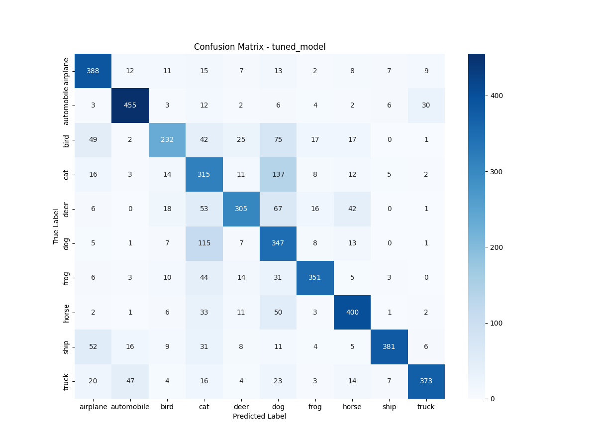

# DA5402 - Assignment 5
## Nikshay Jain | MM21B044

This project focuses on training & evaluating CNN models for the CIFAR-10 dataset. The project is divided into tasks, including data partitioning, model training, hyperparameter tuning, and performance evaluation.

## Table of Contents
1. [Project Overview](#project-overview)
2. [Directory Structure](#directory-structure)
3. [Setup Instructions](#setup-instructions)
4. [Usage](#usage)
5. [Tasks](#tasks)
   - [Task 1: Data Partitioning](#task-1-data-partitioning)
   - [Task 2: Model Training](#task-2-model-training)
   - [Task 3: Model Evaluation](#task-3-model-evaluation)
   - [Task 4: Partition-Specific Training](#task-4-partition-specific-training)
6. [Results](#results)
7. [Closing Note](#closing-note)

---

## Project Overview
The goal of this project is to classify images from the CIFAR-10 dataset into 10 categories: airplane, automobile, bird, cat, deer, dog, frog, horse, ship, and truck. The project involves:
- Partitioning the dataset into subsets (`v1`, `v2`, `v3`, `v1+v2`, `v1+v2+v3`)
- Further splitting into train, val and test sets.
- Training models using hyperparameter tuning.
- Evaluating model performance on test data.
- Generating reports and visualizations.

---

## Directory Structure

```bash
project_root/
├── data/                   # Original raw dataset directory
├── partition/              # Partitioned datasets (v1, v2, v3, v1+v2, v1+v2+v3)
│   ├── v1/
│   │   ├── train/
│   │   ├── val/
│   │   └── test/
│   ├── v2/
│   │   ├── train/
│   │   ├── val/
│   │   └── test/
│   └── ...
├── models/                 # Trained models
├── reports/                # Evaluation reports
├── figures/                # Confusion matrix plots
├── logs/                   # Log files
├── venv/                   # virtual env file
├── hyperparameter_tuning/  # Files created while training the model
├── scripts/                # Python scripts
│   ├── dataset.py          # Task 1: get dataset
│   ├── data_prep.py        # Task 2: preprocess dataset
│   ├── partition.py        # Task 2: create partitions needed
│   ├── pull_data.py        # Task 3: pull data from dvc
│   ├── model_train_eval.py # Task 3 & 4: train and evaluate models for data and paritions both
│   └── brownie.py          # Brownie task to get the class distributions
├── params.yaml             # Configuration file
├── .dvcignore              # dvc ignore file
├── .gitignore              # gitignore file
├── A5.pdf                  # Assignment pdf
├── dvc.yaml                # workflow to run
├── partition.dvc           # dvc tracker for partition
├── requirements.txt        # Libraries list
└── Readme.md               # Project documentation
```

## Setup Instructions

1. **Clone the Repository**:
   ```bash
   git clone https://github.com/Nikshay-Jain/DA5402-Assign-5.git
   cd DA5402-Assign-5
   ```

2. **Install Dependencies**:
   Ensure you have Python 3.11+ installed to the required libraries:
   ```bash
   pip install -r requirements.txt
   ```
   This file installs the libraries used by the code:
    - TensorFlow
    - Keras Tuner
    - Scikit-learn
    - Matplotlib
    - Seaborn
    - NumPy
    - PyYAML
    - DVC
    - Shutils

3. **Set Up DVC**:
   As DVC is used for data versioning, setup the system:
   ```bash
   dvc init
   git add .dvc .gitignore
   git commit -m "Initialized DVC"
   ```
   Optionally use a cloud storage like Google Drive, AWS S3, Azure, etc., configure accordingly:
   ```bash
   dvc remote add -d origin gdrive://<your-drive-folder-id>
   ```

---

## Usage
### Task 1: Data setup
Run the dataset script to get the dataset from the web:
```bash
python scripts\dataset.py
```
This creates a directory if its absent in the `DA5402-Assign-5` folder where the data is loaded for future access.


### Task 2: Data processing & partitioning
Run the following scripts to process `data` folder and create subsets named (`v1`, `v2`, `v3`, `v1+v2`, `v1+v2+v3`) in a new folder called `partition`, along with train, val, test split in them:
```bash
python scripts\data_prep.py
python scripts\partition.py
```

Get DVC to track this folder now:
```bash
dvc add partition
git add partition.dvc .gitignore
git commit -m "partition tracked"
```

### Task 3: Pulling data and Model Training
#### Pull Data from DVC - simply execute
```bash
python scripts\pull_data.py
```

#### Data Preparation - already done as a part of Task 2 above

#### Train models using hyperparameter tuning and evaluate performance with report:
The code file contains all the necessar workflow to get that done. This also starts execution over v1, v2, etc for task 4 ahead of time for the parameters mentioned in `params.yaml` (random_seed=42).

```bash
python scripts\model_train_eval.py
```

The code file, when executed, generates:
- logs to be stored in `logs`
- best performing model to be stored in `model` as `keras` files
- evaluation reports in `reports` as `json` files
- confusion matrix stored in the `mode_training_... .log` files along with `figures` folder as `png` files.

All of the mentioned folders are created automatically on first run.

### Task 4: Train and test on partitions using dvc
As mentioned earlier, for `random_seed = 42`, the execution is already completed by the run of `model_train_eval.py` in task 3 on all necessary partitions:
- v1
- v2
- v3
- v1+v2
- v1+v2+v3.

For execution on a different value of random seed, just get that edited in params.yaml file and re-execute:

```bash
python scripts\model_train_eval.py
```

All the output files get saved in the directories discussed for task 3.

I have executed the tasks for `random_seed` = 21, 42, 84 as asked in the assignment and would encourage the reader to try out the same to verify.

### Note:
The Tasks 3 and 4 can also be run by the following single command:
```bash
dvc repro
```

### Brownie Task: Which are most misclassified classes

As per the observations made across executions, I figured out that the most misclassified classes are that of `dogs` and `cats`. The reason being their similiar features and small image resolution making it difficult for model to learn.

It can also be oberved that `bird` is also misunderstood for `cat` and `dog` bt the reverse is not true. This again might be due to the generic shape of the creature resembling with the facial features of cats and dogs. It is to be noted that the shaer numbe of bird images might cause an issue but that does not seem convincingly the only reason responsible to me.

```
The trimmed report is as attached for execution over `v1`. The misclassification table for all the 3 classes can be found below itself:
{
    "partition": "v1",
    "random_seed": 42,
    "overall_accuracy": 0.6188,
    "class_accuracy": {
        "airplane": 0.616,
        "automobile": 0.572,
        "bird": 0.344,
        "cat": 0.58,
        "deer": 0.52,
        "dog": 0.684,
        "frog": 0.668,
        "horse": 0.712,
        "ship": 0.704,
        "truck": 0.788
    },
    "classification_report": {
        ...
        ...
        "cat": {
            "precision": 0.35194174757281554,
            "recall": 0.58,
            "f1-score": 0.4380664652567976,
            "support": 250.0
        },
        "bird": {
            "precision": 0.5119047619047619,
            "recall": 0.344,
            "f1-score": 0.41148325358851673,
            "support": 250.0
        },
        "dog": {
            "precision": 0.4572192513368984,
            "recall": 0.684,
            "f1-score": 0.5480769230769231,
            "support": 250.0
        },
        ...
        ...
        "accuracy": 0.6188,
        "macro avg": {
            "precision": 0.6568712595152426,
            "recall": 0.6188,
            "f1-score": 0.6251026912207822,
            "support": 2500.0
        },
        "weighted avg": {
            "precision": 0.6568712595152426,
            "recall": 0.6188,
            "f1-score": 0.6251026912207822,
            "support": 2500.0
        }
    },
    "misclassification_table": {
        ...
        ...
        "cat": {
            "airplane": 2,
            "automobile": 0,
            "bird": 6,
            "deer": 8,
            "dog": 68,
            "frog": 10,
            "horse": 8,
            "ship": 2,
            "truck": 1
        },
        "bird": {
            "airplane": 10,
            "automobile": 0,
            "cat": 59,
            "deer": 18,
            "dog": 49,
            "frog": 12,
            "horse": 10,
            "ship": 3,
            "truck": 3
        },
        "dog": {
            "airplane": 0,
            "automobile": 0,
            "bird": 5,
            "cat": 48,
            "deer": 6,
            "frog": 3,
            "horse": 16,
            "ship": 0,
            "truck": 1
        },
        ...
        ...
    }
}
```
The class distributions for the test data are as follows:
**Class distributions**:
  
---

## Results
### Model Performance
- Overall accuracy and class-wise accuracy are reported for each model in `reports/` directory.
- Confusion matrices are saved in the `figures/` directory.

### Example Output
- **Evaluation Report**:
  ```json
  {
    "overall_accuracy": 0.7182,
    "class_accuracy": {
        "airplane": 0.7584745762711864,
        "automobile": 0.8298279158699808,
        ...
        ...
    },
    "classification_report": {
        "airplane": {
            "precision": 0.7188755020080321,
            "recall": 0.7584745762711864,
            "f1-score": 0.7381443298969073,
            "support": 472.0
        },
        "automobile": {
            "precision": 0.8966942148760331,
            "recall": 0.8298279158699808,
            "f1-score": 0.8619662363455809,
            "support": 523.0
        },
        ...
        ...

        "accuracy": 0.7182,
        "macro avg": {
            "precision": 0.743064553011495,
            "recall": 0.7169621918063662,
            "f1-score": 0.7212929509201313,
            "support": 5000.0
        },
        "weighted avg": {
            "precision": 0.7428207993165605,
            "recall": 0.7182,
            "f1-score": 0.7220540257965723,
            "support": 5000.0
        }
    },
    "misclassification_table": {
        "airplane": {
            "automobile": 8,
            "bird": 12,
            "cat": 13,
            "deer": 20,
            "dog": 18,
            "frog": 5,
            "horse": 3,
            "ship": 23,
            "truck": 12
        },
        ...
        ...
    }
  }
  ```

- **Confusion Matrix**:
  

---

## Closing Note:
In case of debugging, the log files can be referred in the `logs/` folder.
The folders in `hyperparameter_tuning` can also help to know the status and results of executions.